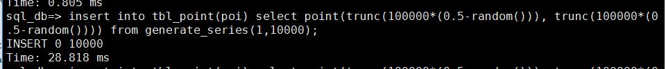


<h2>{{ category | first }}</h2>
{{ category | last | size }}
<ul class="arc-list">
    
        <li>{{ post.date | date:"%d/%m/%Y"}}<a href="{{ post.url }}">{{ post.title }}</a></li>
    
</ul>


###### Header 6

| head1        | head two          | three |
|:-------------|:------------------|:------|
| ok           | good swedish fish | nice  |
| out of stock | good and plenty   | nice  |
| ok           | good `oreos`      | hmm   |
| ok           | good `zoute` drop | yumm  |

### 这是一条水平线

---

### Large image

- /assets/image/ps001.jpg

### Definition lists can be used with HTML syntax.

## 测试


-  {{ post.url }} {{ post.title }}
{{ post.excerpt | remove: 'test' }}


## moods


-   {{ mood.url }} {{ mood.title }}
{{ mood.excerpt | remove: 'test' }}


## posts


 - {{ post.date | date_to_string }} <a href="{{ site.baseurl }}{{ post.url }}">{{ post.title }}</a>


## blog


 - {{ blog.date | date_to_string }} <a href="{{ site.baseurl }}{{ blog.url }}">{{ blog.title }}</a>


## 心情

